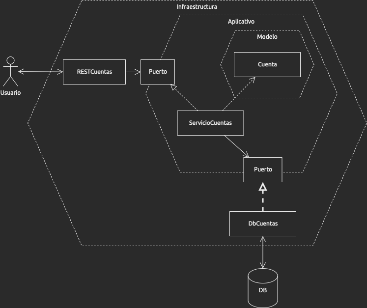

# Arquitectura Hexagonal

Los desarrolladores de software nos encuentramos repetidamente con la misma pregunta: **¿Cómo organizar los componentes y el código de un proyecto?**. 

[Alistair Cockburn propuso una solución genérica en el 2005](https://alistair.cockburn.us/hexagonal-architecture/) con un patrón de arquitectura conocido como _Arquitectura Hexagonal_, o _Arquitectura de Puertos y Adaptadores_.

Esta arquitectura tiene como objetivo **minimizar el acoplamiento entre componentes**, y así reducir el impacto al remplazar componentes y facilitar el uso de _mocks_ en la automatización de pruebas.

Es comunmente representada utilizando una variación del siguiente diagrama, donde existen 3 capas (infraesctura, aplicación y modelo) y **las dependencias son exclusivamente de afuera hacia adentro**; es decir, por ejemplo, ningún componente de la capa `Aplicación` debe depender de un componente en la capa `Infraesctura`.

Este principio que se acaba de introducir es muy importante, así que lo voy a repetir: **las dependencias son exclusivamente de afuera hacia adentro**.

Pero antes de entrar en los detalles de esta arquitectura, veamos cómo se llegó a ella.

## Antecedentes
La _arquitectura de capas_, conocida también como _arquitectura de 3-capas_ o _N-capas_, que se convirtió en la norma a comienzos de la década del 2000 al aumentar la popularidad de las aplicaciones cliente/servidor, propone separar los componentes en capas, tradicionalmente en 3 capas:

Por ejemplo, una aplicación de un servicio REST, tendría en su capa de _presentación_ una clase para exponer el punto de contacto REST `GET /cuentas/:id`.

En Java, una implementación posible sería una clase `RESTCuentas` en el paquete `presentación`:

    package presentacion;
    
    import logica_de_negocios.ServicioCuentas;
    
    class RESTCuentas {
    
      ServicioCuentas servicio;
    
      // Responde a un pedido HTTP GET /cuentas/:id
      Cuenta obtenerPorId(long id) {
          return servicio.obtenerPorId(id);
      }
    }

Lo importante de notar en esta clase `RESTCuentas` es la instrucción:

    import logica_de_negocios.ServicioCuentas;

Este `import` es la dependencia representada por la flecha:

Es decir, para compilar y ejecutar correctamente el código de `presentacion.RESTCuentas` se **necesita** acceso a `logica_de_negocios.SrvCuentas`, pero **no** vice versa.

Igualemente, una clase en la capa `logica_de_negocios` tendría una dependencia hacia una clase de la capa `acceso_a_datos`:

    package logica_de_negocios;
    
    import acceso_a_datos.DbCuentas;
    
    class SrvCuentas {
    
      DbCuentas repo;
    
      Cuenta obtenerPorId(long id) {
          return repo.selectCuentaPorId(id);
      }
    }

Es una implementación bastante simple, no hay lógica de negocios como tal, solo una llamada directa a la capa de `acceso_a_datos`, pero se ha hecho así a propósito para mantener el foco en las dependencias entre componentes. Una vez más, la dependencia está marcada por la instrucción `import`:

    import acceso_a_datos.DbCuentas;

Y es la dependencia representada por la flecha:

## ¿Cúal es el problema?

Hasta ahora todo parece bien: Las capas lógicas nos permiten separar el código de presentación, el código aplicativo y el código de acceso a las bases de datos en diferentes paquetes. ¿Por qué no es suficiente este tipo de separación lógica?

Supongamos que ahora necesitamos cambiar la implementación de la clase `acceso_a_datos.DbCuentas` por una clase `acceso_a_datos.DbCuentas`, y ya no regrese una clase tipo `Cuenta` sino que regrese una clase `Map<String, Object>`. Ahora nos vemos obligados no solamente a introducir la nueva clase `NoSQLCuentas`, sino también a **cambiar el código de la clase dependiente:** `ServicioCuentas`.

    package logica_de_negocios;
    
    import acceso_a_datos.NoSQLCuentas; // esta linea de código cambia
    
    class ServicioCuentas {
    
      NoSQLCuentas repo; // Esta linea de código cambia
    
      Cuenta obtenerPorId(long id) {
          // el cuerpo del método también cambia.

          Map<String, Object> registro;
          registro = repo.selectCuentaPorId(id);

          return transformarRecToCuenta(registro);
      }
    }

Este cambio de código en la clase `ServicioCuentas` se ve representado por una nueva flecha hacia `NoSQLCuentas`.

    
Parece un esfuerzo muy simple en este ejemplo, pero una aplicación real puede tener fácilmente docenas de clases en la capa de `logica_de_negocios` que nos veriamos obligados a cambiar.

## Interfaces al rescate

El concepto de *interfaz* o *contrato* existe para proteger las clases de sus dependencias: Consiste en definir las operaciones que se esperan de una clase (sin el código que implementa estas operaciones), este conjunto de operaciones es lo que llamamos *interfaz*; la dependencia se crea entonces hacia esa *interfaz* en lugar de hacerlo directamente a la clase.

¿Cómo sería entonces el cambio descrito en la sección anterior usando *interfaces*?

Digamos que en lugar de la clase `DbCuentas`, `ServicioCuentas` depende de una interfaz `RepoCuentas`:

    interface RepoCuentas {
        Cuenta obtenerCuenta(long id);
    }

El código de la clase `ServicioCuentas` sería:

    package logica_de_negocios;
    
    import acceso_a_datos.RepoCuentas;
    
    class ServicioCuentas {
    
      RepoCuentas repo;
    
      Cuenta obtenerPorId(long id) {
          return repo.obtenerCuenta(id);
      }
    }

En este caso, es la responsabilidad de la clase `DbCuentas` de satifacer el contrato de `RepoCuentas`:

    package acceso_a_datos;
    
    class DbCuentas implements RepoCuentas {
    
      Cuenta obtenerCuenta(long id) {
          // Código implementando la intefaz
      }
    }

En importante notar el `import` que la clase `DbCuentas` debe hacer en este caso, al implementar la interfaz `RepoCuentas`, debe importarla.

Gráficamente, estas dos dependencias serían:

El diagrama deja en evidencia el beneficio de utilizar la intefaz: Si cambiamos `DbCuentas` por `NoSQLCuentas` (quién también debe satifacer la intefaz `RepositorioCuentas`), la clase `ServicioCuentas` no se ve afectada:

**el código en la capa de** `ServicioCuentas` **queda exactamente igual** dado que la dependencia de `ServicioCuentas` es con `RepoCuentas` y no con `DbCuentas`. Las lineas que código que antes cambiaban cuando no teníamos una *interfaz* de por medio, ahora quedan iguales:

    package logica_de_negocios;
    
    // el import NO cambia
    import acceso_a_datos.RepoCuentas;
    
    @Service
    class ServicioCuentas {
    
      // la referencia a la intefaz NO cambia
      RepoCuentas repo;
    
      Cuenta obtenerPorId(long id) {
          // el llamado a obtenerCuenta NO cambia
          return repo.obtenerCuenta(id);
      }
    }
    
    // ¡NADA cambia!

Este mismo patrón se puede aplicar para desacoplar la dependencia entre la clase `RESTCuentas` y la clase `ServicioCuentas`:

El diagrama anterior ilustra el fundamento principal en el cuál se base la arquitectura hexagonal: **Desacoplamiento de componentes a través de interfaces.**

## Otra Perspectiva

Retrocedamos al diagrama de 3-capas:

¿Cuál sería otra manera de dibujar el mismo diagrama?

Si analizamos el diagrama se puede remarcar que la capa `Modelos` seguida por la capa `Lógica de negocios` son las dos más _lejanas_ al _mundo físico_ (el usuario y la base de datos), mientras las capas `Presentación` y `Acceso a Datos` son las más cercanas al _mundo físico_.

La *Arquitectura Hexagonal* reune los componentes por _cercanía_ al mundo físico. Los componentes de `Presentación` y`Acceso a Datos` se juntan en un capa `Infraestructura`:

¿Recuerdan el principio que repetimos al comienzo?: **Las dependencias son exclusivamente de afuera hacia adentro**.

Este diagrama rompe con este principio. Hay una flecha que apunta en el sentido contrario, de adentro hacía afuera: Es la flecha entre `ServicioCuentas` y `DbCuentas`. Ya sabemos porqué esto es un problema: Si queremos cambiar `DbCuentas` por una implementación alternativa, digamos `NoSqlDbCuentas`, impactamos el código de la clase `ServicioCuentas`. La separación en capas concentricas con dependecias de afuera hacía adentro tiene cómo objetivo justamente **proteger las clases internas de cambios en las capas más externas**.

**¿Cómo logramos cambiar la dirección de esta flecha?**

Si introducimos ahora el concepto de interfaces, el diagrama quedaría así:

Como podemos ver, la flecha de dependencia de `ServicioCuentas`a `DbCuentas`, que era una dependecia de tipo *uso*; ahora paso a ser una dependencia de `DbCuentas` a la interfaz `RepoCuentas`, en forma de una dependencia de tipo *implementación*. Ahora sí se está respentando el principio de protección concentrico de la *Arquitectura Hexagonal*: La capa más externa, *capa de infraesctura*, es la más cercanas a la tecnología y la más propensa a cambiar, mientras que las capas internas son las más cercanas a la lógica de negocios que no cambia de una tecnología a otra.

Una representación alternativa es ilustrar las interfaces como _puertos_, dando origen al nombre de *Arquitectura de Puertos y Adaptadores*.

